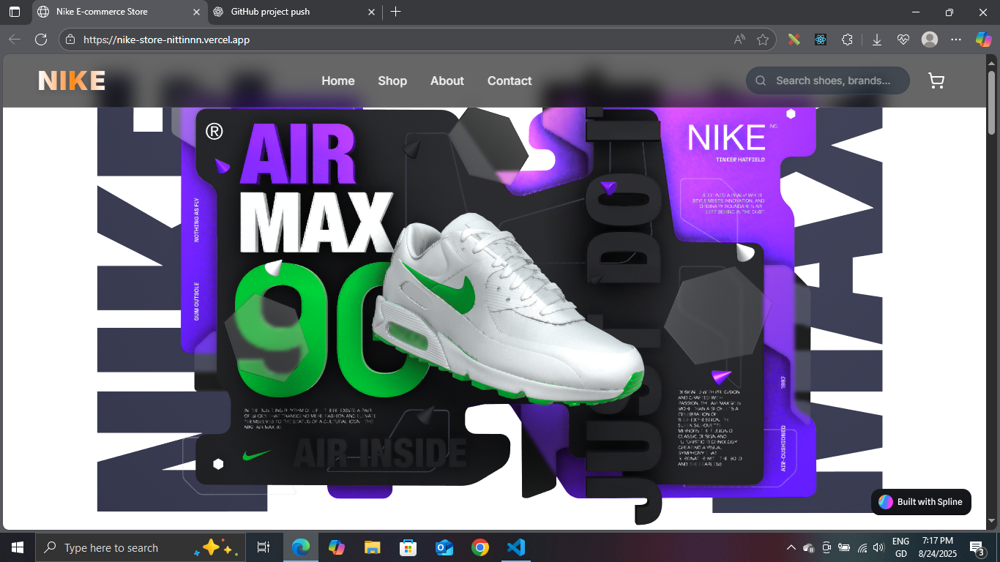
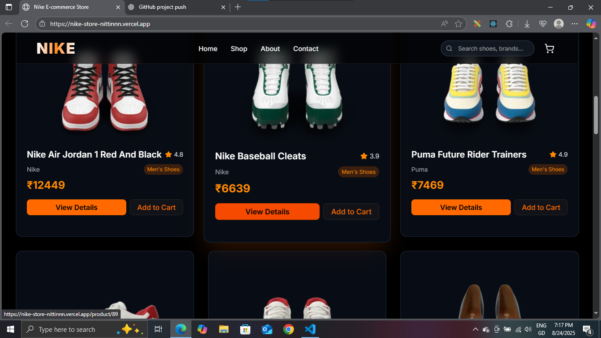
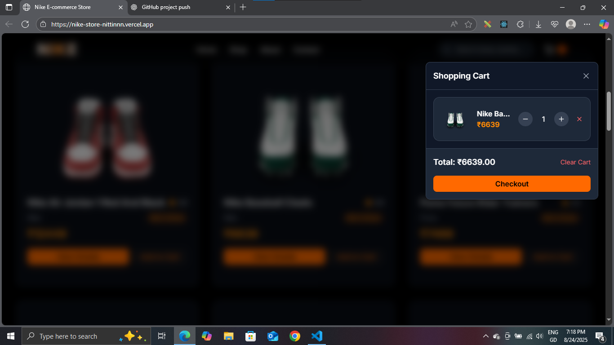

# 🏬 Nike Store Clone  

A modern **Nike Store E-commerce Web App** built with **Next.js 14, React, TailwindCSS, Supabase, and Vercel**.  
This project replicates an online shopping experience with authentication, product browsing, cart management, checkout, and order confirmation.  

🔗 **Live Demo:** [nike-store-nittinnn.vercel.app](https://nike-store-nittinnn.vercel.app/)

---

## ✨ Features

- 🛍️ Product Listing & Detailed Product Pages
- 🛒 Add to Cart & Cart Dropdown
- 💳 Checkout & Order Confirmation Flow
- 👤 User Profile & Order History
- 🎨 Modern UI with TailwindCSS + ShadCN components
- 📱 Responsive Design (Mobile + Desktop)
- ⚡ Fast Deployment on Vercel

---

## 🖼️ Screenshots  

### Homepage  


### Product Page  


### Cart & Checkout  


---

## 🛠️ Tech Stack  

- **Framework:** [Next.js 14](https://nextjs.org/)  
- **Frontend:** React, TailwindCSS, ShadCN/UI  
- **Backend & Auth:** [Supabase](https://supabase.com/)  
- **Hosting:** [Vercel](https://vercel.com/)  

---

## 🚀 Getting Started  

### 1. Clone Repo  
```bash
git clone https://github.com/nitinbutnvm/nike-store.git
cd nike-store
```

2. Install Dependencies
```   
npm install
```
3. Setup Environment Variables

   Create a .env.local file in root:
```
NEXT_PUBLIC_SUPABASE_URL=your_supabase_url
NEXT_PUBLIC_SUPABASE_ANON_KEY=your_supabase_anon_key
SUPABASE_URL=your_supabase_url
SUPABASE_ANON_KEY=your_supabase_anon_key
```
4. Run Locally
```
npm run dev
```
App will be available at 👉 http://localhost:3000

📌 Roadmap

 *Add User Authentication (Signup/Login via Supabase)

 *Add Payment Gateway Integration (Stripe/PayPal)

 *Add Wishlist Feature

 *Admin Dashboard for Product Management

 *Dark Mode Toggle

🤝 Contributing
Pull requests are welcome! For major changes, please open an issue first to discuss what you would like to change.

📧 Contact
For queries or collaborations:
Nitin – heynittinnn@gmail.com


⭐ If you like this project, don’t forget to star the repo on GitHub!
